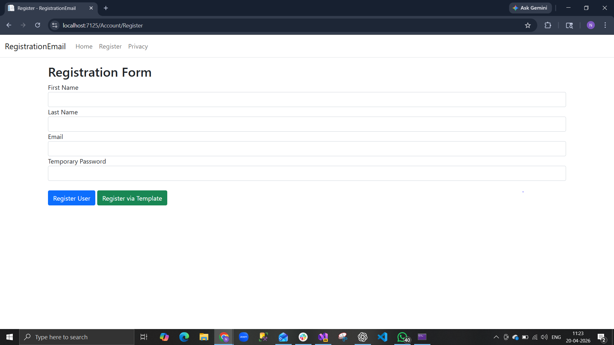
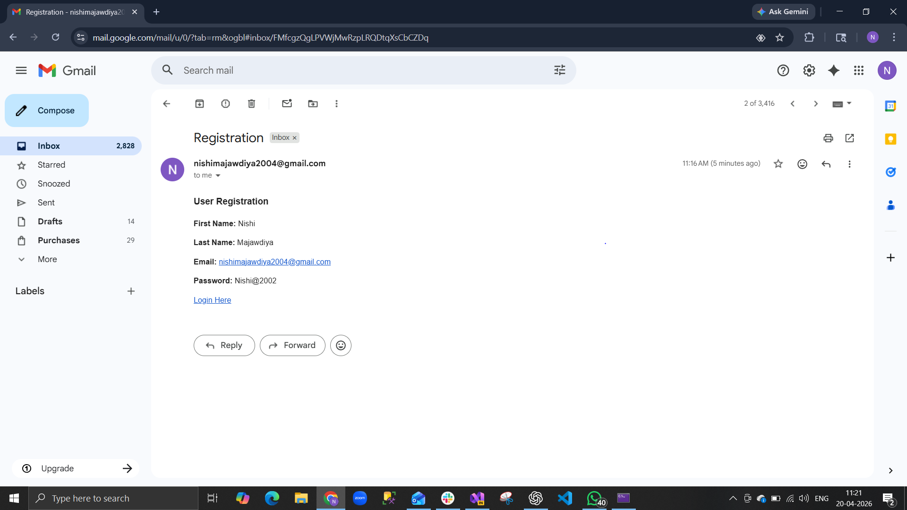
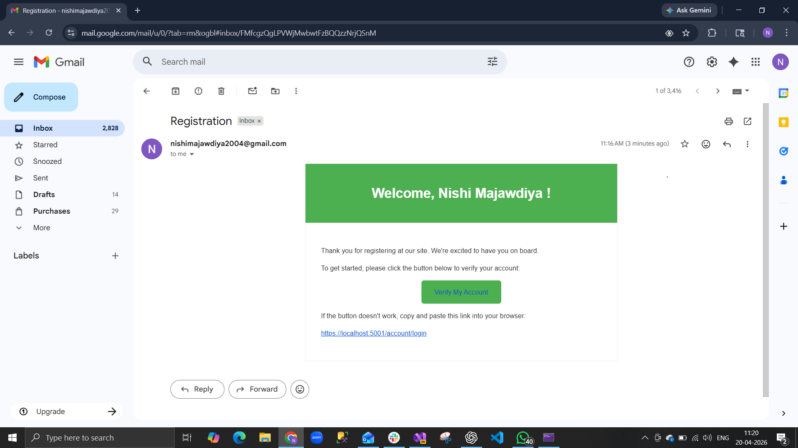

# 📧 ASP.NET Core MVC Registration Email System

## 🚀 Overview
This project is a user registration system built using ASP.NET Core MVC.  
It allows users to register through a form and receive a dynamic email containing their details and an activation link.

The application follows the MVC pattern and demonstrates secure email handling using SMTP with **User Secrets**.

---

## ✨ Features

- User Registration Form (MVC Architecture)
- Strong Password Validation (Regex-based)
- Email Sending using SMTP (Gmail)
- HTML Email Template Support
- Dynamic Placeholder Replacement (First Name, Last Name, Email, Link)
- Two Registration Modes:
  - Normal Email
  - Template-based Email
- Secure Credential Storage using **User Secrets**

---

## 🛠️ Tech Stack

- ASP.NET Core MVC
- C#
- Razor Views
- Bootstrap (UI)
- SMTP (Gmail App Password)
- .NET User Secrets (Security)

---

## 🔐 Password Requirements

The temporary password must contain:

- At least 1 uppercase letter  
- At least 1 lowercase letter  
- At least 1 numeric digit  
- At least 1 special character  
- Minimum length: 10 characters  

---

## 📸 Screenshots

### 📝 Registration Form

### 📧 Email Received

### 📧 Email via Template

---

## ⚙️ How to Run

1. Clone the repository:

git clone https://github.com/YOUR_USERNAME/RegistrationEmailApp.git

2. Open the project in Visual Studio / VS Code

3. Configure **User Secrets** (recommended for security):

dotnet user-secrets init
dotnet user-secrets set "Smtp:Host" "smtp.gmail.com"
dotnet user-secrets set "Smtp:Port" "587"
dotnet user-secrets set "Smtp:Username" "your-email@gmail.com
"
dotnet user-secrets set "Smtp:Password" "your-app-password"
dotnet user-secrets set "Smtp:From" "your-email@gmail.com
"

4. Run the project

5. Open in browser:

https://localhost:xxxx/Account/Register

---

## 📬 Email Configuration

- SMTP Server: smtp.gmail.com  
- Port: 587  
- Encryption: TLS  

⚠️ Important:
- Use **App Password**, not your Gmail password  
- Do NOT store credentials in `appsettings.json`  
- Use **User Secrets** for development  

---

## 🧠 How It Works

1. User fills the registration form  
2. Server validates input and password rules  
3. Email content is generated dynamically  
4. HTML template placeholders are replaced  
5. Email is sent using configured SMTP credentials  

---

## 🔒 Security Best Practices

- Credentials are stored using **User Secrets**
- Sensitive data is not pushed to GitHub
- Follows secure configuration practices

---

## 📌 Future Enhancements

- Email verification with token-based activation  
- Login & Authentication system  
- Database integration (SQL Server + EF Core)  
- JWT Authentication  
- Forgot Password feature  

---

## 👩‍💻 Author

**Nishi Majawdiya**  

---